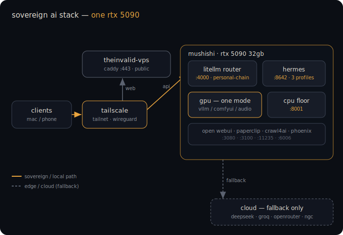
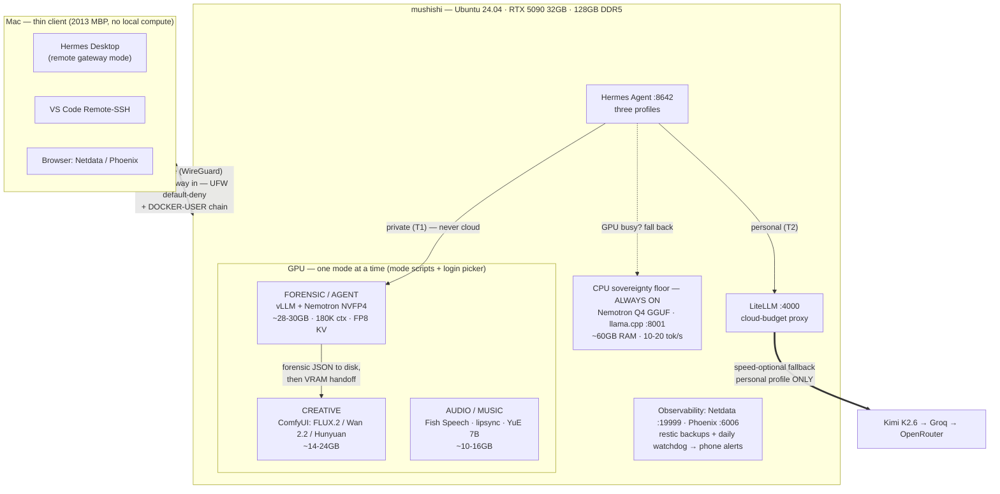

# 🧠 Mushishi Sovereign AI Stack

**A self-hosted, privacy-first AI command center on a single RTX 5090: multimodal LLM serving, tiered cloud fallback, and hard sovereignty guarantees — where "this data never leaves the machine" is enforced by routing, not by promise.**

Daily-driven since May 2026 on: Ryzen 9 9900X3D · 128GB DDR5 · RTX 5090 32GB · Ubuntu 24.04, with a 2013 MacBook Pro as a thin client over Tailscale. Companions: [creative stack](https://github.com/MushiSenpai/mushishi-creative-stack) · [audio stack](https://github.com/MushiSenpai/mushishi-audio-stack).

<p align="center"></p>

---

## How this was built (read this first)

I don't hand-write code. Every script, compose file, and config in this repo was written by LLMs (Claude primarily; idea-stage input from Gemini, Grok, and Kimi) under my direction. My work is everything around the code: architecture and tool selection, the specs the LLMs execute against (spec-driven development with snapshot/verify gates), debugging direction, verification, and day-2 operations. I have a B.E. in Computer Science — I read code fluently; I direct rather than write it. This repo is both the artifact and the evidence that the method works. The [Decision Log](docs/mushishi-sovereign-ai-stack-v1.7.1.md) at the end of the spec preserves the full reasoning for every pivot — including six hours of TRT-LLM debugging that ended in choosing vLLM instead.

---

## The core idea: sovereignty tiers

Every tool and workflow is classified before adoption, and routing enforces the class:

| Tier | Trust boundary | Example |
|---|---|---|
| **T1 Sovereign** | Local only — *cannot* reach a cloud API | Client media analysis, private profiles |
| **T2 Speed-optional** | Local first, cloud fallback allowed | General agent work, research |
| **T3 Cloud-explicit** | Cloud deliberately traded for capability | Heavy coding agents |
| **T4 Coordination** | Local-hosted, orchestrates across tiers | Management plane |

The interesting part is the **fallback chains**. Three profiles, three different guarantees:

```
personal:  GPU Nemotron → CPU Nemotron → Kimi → Groq → OpenRouter   (speed-optional)
private:   GPU Nemotron → CPU Nemotron → QUEUE. Never cloud.        (T1 enforced)
client:    GPU Nemotron (forensic config) → ERROR. No fallback.     (quality enforced —
            a silent downgrade to CPU/cloud would degrade the output downstream)
```

That third one matters: for client work, *failing loudly* beats degrading silently.

## Architecture



The diagram is text (Mermaid), versioned with the repo, and updated when the
architecture changes — a diagram that can drift from reality is worse than no
diagram.

## What's running

```
GPU (one mode at a time — 32GB is a budget, not a suggestion):
  FORENSIC  vLLM 0.20 + Nemotron-3-Nano-Omni NVFP4   ~28-30GB  180K ctx, FP8 KV
  AGENT     same model, lighter config                ~22GB    131K ctx
  CREATIVE  handoff to ComfyUI stack                  ~14-24GB
CPU (always on — the sovereignty floor):
  Nemotron Q4 GGUF via llama.cpp (:8001)              ~60GB RAM, 10-20 tok/s
Services:
  Hermes agent (:8642) · LiteLLM cloud-budget proxy (:4000) · DeerFlow research
  Arize Phoenix traces (:6006) · Netdata (:19999) · restic backups + watchdog
Security:
  UFW default-deny · everything Tailscale-only · DOCKER-USER chain so Docker
  can't bypass the firewall (it does by default — see LESSONS.md)
```

## Measured

| Metric | Value |
|---|---|
| Nemotron NVFP4 throughput (vLLM, RTX 5090) | **275 tok/s** @ 81-85W, 41-45°C |
| Context (total-VRAM bound, not KV-bound) | 180K stable (~228K total-VRAM ceiling; 256K = `max_position_embeddings`) |
| Forensic-mode VRAM | ~28-30GB of 32GB |
| Concurrent long-context agent ceiling | 3-5 sessions before KV-cache thrash |

Full methodology + raw CSV in [benchmarks/](benchmarks/). Updated weekly.

## Why vLLM and not NIM or TensorRT-LLM

Short version: TRT-LLM 1.3's AutoDeploy cannot trace multimodal-mandatory models — confirmed through six hours of structured debugging; NVIDIA's own benchmark paper and the model card both prescribe vLLM for this model. Long version with every dead end: **Decision Log §1–6** in the [spec](docs/mushishi-sovereign-ai-stack-v1.7.1.md). The dead ends are documented because they're the expensive part.

Other non-obvious choices the spec defends: NVFP4 over FP8 (it's the only quantization leaving real *total*-VRAM headroom on 32GB), `--moe-backend triton` (FlashInfer MoE is broken on consumer Blackwell), display on iGPU to reclaim ~1GB of total VRAM, and a five-question tool-evaluation checklist that has kept the stack from accreting hype.

> **Correction (2026-06-21):** earlier versions of this repo costed KV-cache as if Nemotron were a dense transformer and claimed "~25K context tokens per GB." Nemotron-3-Nano-Omni is a **NemotronH Mamba-2 / Transformer-MoE hybrid** — only **6 of its 52 layers do attention**, so FP8 attention-KV is ~**3 KB/token** (= 2 × 6 × 2 × 128), i.e. ~**350K tokens of attention-KV per GiB**, not ~25K. Because attention-KV is this cheap on a hybrid, **KV is not the binding constraint** on context — the 32GB ceiling is dominated by weights + CUDA graphs + multimodal buffers + per-sequence Mamba state. The full write-up: [theinvalid.me/blog/i-had-my-kv-cache-math-14x-wrong](https://theinvalid.me/blog/i-had-my-kv-cache-math-14x-wrong).

## Repo layout

```
docs/        the full spec (4,200 lines): phases, gates, VRAM math, Decision Log
scripts/     mode switching, firewall hardening, backups, watchdog, GUI mode picker
configs/     vLLM/Nemotron compose (every flag justified), LiteLLM, Phoenix
benchmarks/  raw measurement CSV + methodology
LESSONS.md   the fixes that cost real time — cron PATH, Docker vs UFW, env precedence
.env.example every variable a replicator needs
```

## License

MIT. Model weights carry their own licenses.
